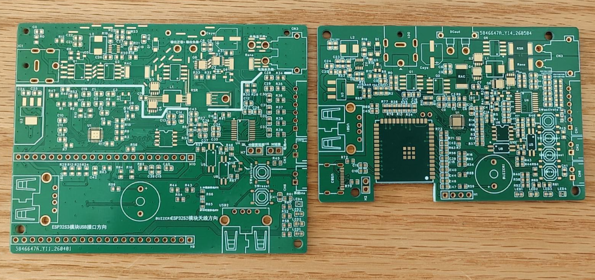
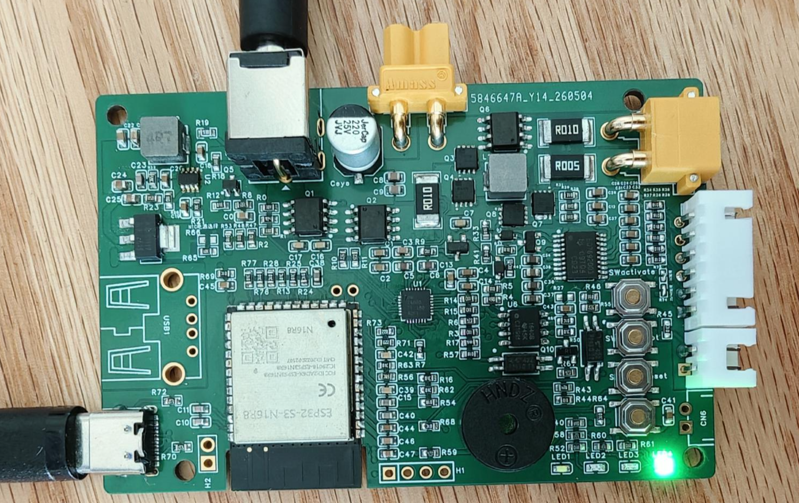

# OpenUPS-ESP32S3

基于 ESP32-S3 的智能锂电池 UPS 控制系统，使用 BQ24780S/BQ24800 充电管理芯片与 BQ76920 电池监控芯片实现BMS管理，支持 3-5 串锂离子/磷酸铁锂电池，12-19V 宽电压输入。

以下英文为机翻：

An intelligent lithium battery UPS control system based on ESP32-S3, using BQ24780S/BQ24800 charger IC and BQ76920 battery monitor IC for BMS management, supporting 3-5 cell Li-ion/LiFePO4 batteries with 12-19V wide voltage input.

> **为什么不用铅酸 UPS？** 铅酸 UPS 待机功耗 10W+，体积笨重。本项目面向小功率主机、NAS、软路由、网络设备等场景，锂电池方案更小巧、更省电、更安静。
> **Why not lead-acid UPS?** Lead-acid UPS has 10W+ standby power consumption and bulky size. This project targets low-power hosts, NAS, soft routers, and network devices — lithium battery solutions are smaller, more energy-efficient, and quieter.

> **会不会炸飞老铁？** 做这个东西的初衷就是思考——为什么锂电池不安全？一个是电池管理问题，一个是心理暗示。电池管理方面，放弃粗暴的浮充方式，可设定充电起止范围，让电池在最佳区间保存，同时可精准限定充电电压、电流，还可以限定充电窗口时间，再就是电池管理芯片也要用好的，很多芯片的误差范围很大。心理方面，那就把所有信息都透明显示、可监控，这不还可以用 HA 或者米家联动嘛。其实家里锂电池设备好多——笔记本电脑、各种吸尘器、扫地机器人、洗地机、牙刷、剃须刀……如果谈不安全，都不安全。而且本项目的设计就是让电池一直处于安全的中间电量阶段范围（40%～80%），UPS 充电次数很少，一年也就几次。
> **Will it explode?** The original motivation was to think — why are lithium batteries unsafe? Two factors: battery management and psychological perception. On management: we abandon crude float charging, allowing configurable charge start/stop ranges to keep batteries in optimal zones, with precise voltage/current limits and time windows. Quality battery management chips matter — many have large error margins. On perception: display all information transparently and make it monitorable — you can even integrate with Home Assistant or Xiaomi Home. Actually, many household devices use lithium batteries — laptops, vacuums, robot vacuums, floor washers, electric toothbrushes, razors... If we're talking about safety risks, they all have them. Moreover, this project keeps batteries in the safe middle range (40%~80%), with very few charge cycles per year — just a few times.

> **为什么不用磷酸铁锂？** 磷酸铁锂长期处于浅充浅放状态，库仑计会有巨大积累误差，也许某天真正停电就失速了。综合来说，还是三元锂更符合预期。
> **Why not LiFePO4?** LiFePO4 in long-term shallow charge/discharge cycles causes huge accumulated errors in the coulomb counter — when a real power outage occurs, it may fail unexpectedly. Overall, ternary lithium (NCM/NCA) better meets expectations.
>
> ----------------------------------------------------------
>
> 最新代码新增了磷酸铁锂的支持，可我没有磷酸铁锂电池，所以并没有测试，请自行评估。
>
> The latest commit adds support for LFP (LiFePO₄) batteries. However, since I don't have an LFP battery on hand, this feature has not been tested. Use at your own risk.

> **怎么接入米家？** 把米家温湿度计上的传感器拆掉，通过 I2C 连接到主板。系统模拟 I2C Slave（SHTC3 协议），将电池温度和 SOC（用湿度字段替代）传送给米家温湿度计，从而接入米家智能家居生态。当然这个功能是可选的——毕竟要拆一只温湿度计来实现。详见 [版本说明 - v2 特性变化](#v2-特性变化)。
> **How to integrate with Xiaomi Home?** Remove the sensor from a Xiaomi temperature/humidity monitor and connect it to the mainboard via I2C. The system simulates an I2C Slave (SHTC3 protocol), transmitting battery temperature and SOC (using the humidity field) to the Xiaomi monitor, thereby integrating into the Xiaomi smart home ecosystem. This feature is optional — it requires disassembling a monitor. See [Version Notes - v2 Feature Changes](#v2-feature-changes).

> **电池的选择** 其实UPS常年都是空置，很难使用到一次，一年也就充电多次，没有必要用全新的电池，但一定要用可靠的电池。比如说家里各个设备淘汰下来的电池，吸尘器，扫地机器人，洗地机，甚至手电钻等等，都可以梯次利用，作为ups发光发热。不过这些设备电池在使用前，一定要尽量充电到电压一致，靠bq76920那微弱的平衡能力（增加外置大功率平衡是没有必要的），是需要很久很久很久的。
> **Battery selection** UPS units are typically idle, rarely used, and only charge a few times per year — there's no need for brand new batteries, but they must be reliable. For example, retired batteries from household devices (vacuums, robot vacuums, floor washers, even power drills) can be repurposed for UPS use. However, these batteries must be charged to matching voltages before use — relying on the BQ76920's slow balancing capability (external high-power balancing is unnecessary) would take an extremely long time.

## 功能特性
## Features

### 核心功能
### Core Features

- **USB HID UPS** — ESP32-S3 原生 USB 接口，Windows/macOS/Linux 自动识别为标准 UPS 设备，支持低电量安全关机
- **USB HID UPS** — ESP32-S3 native USB interface, automatically recognized as standard UPS device by Windows/macOS/Linux, supports low-battery safe shutdown
- **充放电管理** — BQ24780S/BQ24800 充电控制，支持自适应充电电流、定时充电窗口（5 组周计划）、混合供电模式
- **Charge/Discharge Management** — BQ24780S/BQ24800 charging control with adaptive charge current, scheduled charging windows (5 weekly plans), hybrid power supply mode
- **电池管理** — BQ76920 电池监控，库仑计 SOC 计算、SOH 学习、自动均衡、多重保护（OV/UV/OCD/SCD/OT）
- **Battery Management** — BQ76920 battery monitoring with coulomb counter SOC calculation, SOH learning, auto-balancing, multiple protections (OV/UV/OCD/SCD/OT)
- **Web 仪表盘** — SPA 单页应用，macOS 风格 UI，实时 WebSocket 数据推送（3 秒间隔）
- **Web Dashboard** — SPA single-page application with macOS-style UI, real-time WebSocket data push (3-second interval)
- **OTA 固件更新** — 网页拖拽上传固件，带签名校验，双分区安全升级
- **OTA Firmware Update** — Web-based drag-and-drop firmware upload with signature verification, dual-partition safe upgrade
- **MQTT 集成** — Home Assistant 自动发现，支持 TLS 加密连接
- **MQTT Integration** — Home Assistant auto-discovery with TLS encrypted connection support
- **Prometheus 监控** — `/metrics` 端点，可直接接入 Grafana
- **Prometheus Monitoring** — `/metrics` endpoint, directly compatible with Grafana
- **米家集成** — 借助米家温湿度计，绕道接入米家，实现温度，SOC与米家系统联动
- **Xiaomi Home Integration** — Via Xiaomi temperature/humidity monitor, indirect integration with Xiaomi Home for temperature and SOC linkage

### 保护机制
### Protection Mechanisms

| 保护类型 | 说明 |
| Protection Type | Description |
|---|---|
| 过压保护 (OV) | 单体电压超阈值，切断充电 FET |
| Overvoltage Protection (OV) | Cell voltage exceeds threshold, charging FET cut off |
| 欠压保护 (UV) | 单体电压低于阈值，切断放电 FET |
| Undervoltage Protection (UV) | Cell voltage below threshold, discharging FET cut off |
| 过流保护 (OCD) | 放电电流超限 |
| Overcurrent Protection (OCD) | Discharge current exceeds limit |
| 短路保护 (SCD) | 短路快速响应 |
| Short Circuit Protection (SCD) | Fast short-circuit response |
| 过温保护 | 板载 + 环境温度双重检测 |
| Overtemperature Protection | Board + ambient temperature dual detection |
| 充电超时 | 防止异常长时间充电 |
| Charge Timeout | Prevents abnormal prolonged charging |
| 系统状态机 | INIT → NORMAL → WARNING → CRITICAL 四级状态管理 |
| System State Machine | INIT → NORMAL → WARNING → CRITICAL four-level state management |

## 版本说明
## Version Notes

### v1 与 v2 区别
### Differences between v1 and v2

v2 与 v1 最大的区别是从开发板换成了贴片模块，去掉了一个 USB 口，缩小了整体体积。
The biggest difference between v2 and v1 is switching from a development board to a SMT module, removing one USB port, and reducing overall size.

v1 与 v2 都支持 **BQ24780S** 与 **BQ24800**，两者引脚兼容。区别是 BQ24800 支持升压输出——有总比没有好。
Both v1 and v2 support **BQ24780S** and **BQ24800**, which are pin-compatible. The difference is BQ24800 supports boost output — better to have than not.

> v2 用 **4 层板**，6 层板是因为领错了券，纯属浪费，对不起嘉立创。
> v2 uses a **4-layer PCB**; the 6-layer board was due to a coupon mistake — a waste, apologies to JLCPCB.

### v2 特性变化
### v2 Feature Changes

v2 没有使用开发板，因此没有 GPIO48 的 RGB 灯。GPIO47/GPIO48 改为 **I2C Slave** 接口，并加了上拉电阻。设计想法是用 GPIO10 模拟电量信号给米家温湿度计供电来显示电量，温度与湿度（可以替换为比如主板温度）通过 I2C Slave 发送给米家温湿度计，从而接入米家智能家居生态。
v2 doesn't use a development board, so there's no GPIO48 RGB LED. GPIO47/GPIO48 are changed to **I2C Slave** interface with pull-up resistors. The design idea is to use GPIO10 to simulate battery level signal for the Xiaomi monitor to display SOC, while temperature and humidity (replacable with e.g. board temperature) are sent via I2C Slave to the Xiaomi monitor, integrating into the Xiaomi smart home ecosystem.

当然，你也可以不用这个功能。米家温湿度计拆下来的传感器没有用了，可以焊在板子预留的焊盘上（代码还没写，回头加上）。到时候是不是可以不用焊接 CN6 以及环境温度 NTC 电阻，用这个替代？
Of course, you can choose not to use this feature. The sensor removed from the Xiaomi monitor can be soldered to the reserved pads on the board (code not yet written, will be added later). Could this replace soldering CN6 and the ambient temperature NTC resistor?

CN6 位置也可以直接把插件 NTC 电阻焊上去，不用那个插座。
The CN6 position can also directly accept a through-hole NTC resistor soldered in place, without using the socket.

> v2 的外壳还没做，代码持续调试升级中，外壳后续做好了再更新。
> v2 enclosure not yet designed; code is continuously being debugged and updated; enclosure will be added later.

### 首次下载程序
### First-Time Programming

启动时按住 **BOOT** 按键（从上到下第二个按钮），再按第三个按钮 **REBOOT**，即可进入下载模式。之后都可以直接通过网页 OTA 更新。
Hold the **BOOT** button (second button from top) during startup, then press the third button **REBOOT** to enter download mode. After that, updates can be done directly via web OTA.

### 焊接提示
### Soldering Tips

焊接板子时，**LDO 5V→3.3V 先不要焊**，先确认 5V 供电正常后再焊上去，以免一波带走芯片。
When soldering the board, **do not solder the LDO 5V→3.3V first** — verify 5V power is normal before soldering it to avoid damaging the chip.

## 硬件
## Hardware

### 关键参数
### Key Specifications

| 参数 | 值 |
| Parameter | Value |
|---|---|
| 输入电压 | 12-19V DC |
| Input Voltage | 12-19V DC |
| 充电电流 | 最高 8128mA（BQ24780S/BQ24800） |
| Charge Current | Up to 8128mA (BQ24780S/BQ24800) |
| 放电电流 | 最高 20A |
| Discharge Current | Up to 20A |
| 输入电流 | 最高 8064mA |
| Input Current | Up to 8064mA |
| 电池类型 | 3-5 串 Li-ion / LiFePO4 |
| Battery Type | 3-5 cell Li-ion / LiFePO4 |
| 电流采样电阻 | 10mΩ（充电侧）/ 5mΩ（放电侧） |
| Current Sense Resistor | 10mΩ (charge side) / 5mΩ (discharge side) |
| I2C 总线 | GPIO11(SDA) / GPIO12(SCL)，100kHz |
| I2C Bus | GPIO11(SDA) / GPIO12(SCL), 100kHz |

### 输出特性说明
### Output Characteristics

这个 UPS 本质上是**电源直通输出**，不具备变压、稳压功能，但可以在电源输出不足的时候，由电池来一起混合输出。当电源掉电的时候，输出的电压实际上就是电池本身的电压，这一点要注意。当然，现在的光猫、路由器、小主机本质上也是宽电压设备，比如 12V 的设备，9-13V 也没什么问题。
This UPS is essentially a **pass-through power output** without voltage conversion or regulation, but it can hybrid-output with the battery when the power supply is insufficient. When power fails, the output voltage is actually the battery's own voltage — keep this in mind. Of course, modern ONTs, routers, and mini PCs are typically wide-voltage devices; for example, a 12V device works fine at 9-13V.

主控 BQ24780S 是可以直接换成 **BQ24800** 的，两者引脚兼容。BQ24800 支持设定一个目标电压，可以让电池升压输出，从而在电源掉电时维持稳定的输出电压。v1 与 v2 均支持 BQ24800（详见[版本说明](#版本说明)）。
The main charger BQ24780S can be directly replaced with **BQ24800** — they are pin-compatible. BQ24800 supports setting a target voltage, enabling boost output from the battery to maintain stable output voltage during power loss. Both v1 and v2 support BQ24800 (see [Version Notes](#version-notes)).

### ESP32 开发板（v1）
### ESP32 Development Board (v1)

v1 使用 **ESP32-S3 N16R8** 版本的开发板（16MB Flash / 8MB PSRAM）。插入时**注意核对引脚排列和插入方向**，反接可能损坏开发板或主板。
v1 uses the **ESP32-S3 N16R8** development board (16MB Flash / 8MB PSRAM). **Verify pin arrangement and insertion direction** — reverse insertion may damage the board or mainboard.

> v2 使用贴片模块，无需开发板，详见[版本说明](#版本说明)。
> v2 uses an SMT module, no development board needed. See [Version Notes](#version-notes).

### 电池夹选择
### Battery Holder Selection

电池组有条件的**尽量选择直接点焊成组**，接触电阻最小、最可靠。
If possible, **directly spot-weld battery packs** — this provides the lowest contact resistance and highest reliability.

如果使用电池夹，建议如下：
If using battery holders, recommendations如下:

| 类型 | 材质 | 优缺点 |
| Type | Material | Pros/Cons |
|---|---|---|
| 插针电池夹 | 钢片 | 夹持力强，但**过紧**，拆装困难 |
| Pin battery holder | Steel | Strong grip, but **too tight**, difficult to install/remove |
| 贴片电池夹 | 铜材质 | 导电好，但**过松**，接触不可靠 |
| SMT battery holder | Copper | Good conductivity, but **too loose**, unreliable contact |
| **贴片铜弹片 + 螺旋弹簧**（推荐） | 黄铜/紫铜 | 导电好，弹簧提供足够的回弹力，**推荐方案** |
| **SMT copper spring + coil spring** (Recommended) | Brass/Copper | Good conductivity, spring provides sufficient rebound force, **recommended solution** |

推荐方案：[贴片铜弹片](https://item.taobao.com/item.htm?id=833701074625) + 线径 0.8mm × 外径 5mm × 长度 50mm 的螺旋弹簧配合使用。弹片负责导电，弹簧负责提供夹持力。
Recommended: [SMT copper spring](https://item.taobao.com/item.htm?id=833701074625) + coil spring (wire diameter 0.8mm × outer diameter 5mm × length 50mm). The copper spring handles conductivity, the coil spring provides clamping force.

> **不建议使用钢片电池夹**，夹持力过大容易损伤电池外壳；纯铜弹片弹力不足，需要搭配螺旋弹簧。
> **Not recommended: steel battery holders** — excessive clamping force can damage battery casing; pure copper springs lack sufficient elasticity and need coil spring pairing.

### 硬件注意事项
### Hardware Notes

- **电池选择** — 电池最好选择品质一致的，并保证初始电压一致。BQ76920 内置的平衡速度极慢，每天大概 20mV 不到。如果是大容量电池，要考虑在线路上增加外部平衡电路，BQ76920 也是支持的
- **Battery Selection** — Choose batteries with consistent quality and matching initial voltages. The BQ76920's built-in balancing is extremely slow, about 20mV per day. For large-capacity batteries, consider adding external balancing circuits on the lines — BQ76920 supports this
- **R27、R66** — 正常情况下**不需要焊接**，这两个电阻用于选择 NTC 与隔离 I2C 芯片的供电源
- **R27, R66** — Normally **do not need soldering** — these resistors select the power source for NTC and isolated I2C chip
- **I2C 隔离芯片** — PCB 设计使用 ISO1640BDR，也可以更换为 ISO1540DR。虽然 ISO1640 标称支持热拔插而 ISO1540 不支持，但实测 ISO1540DR 同样可以正常工作
- **I2C Isolation Chip** — PCB designed for ISO1640BDR, can also use ISO1540DR. Although ISO1640 nominally supports hot-swap while ISO1540 doesn't, testing shows ISO1540DR works fine
- **SW_activate 按键** — 电池刚接入或 BQ76920 进入运输模式后，需要按下此按键一次激活芯片
- **SW_activate Button** — After battery connection or when BQ76920 enters ship mode, press this button once to activate the chip
- **SW_reset 按键** — 长按数秒进入 WiFi AP 模式（重置网络）；开机时持续按住则重新进入配置模式
- **SW_reset Button** — Hold for several seconds to enter WiFi AP mode (reset network); hold during startup to re-enter configuration mode
- **H6、H7 跳线** — 使用 3S 电池需短接 H6，4S 电池需短接 H7（取决于电池串数），**请务必仔细确认后再上电**
- **H6, H7 Jumpers** — Short H6 for 3S batteries, short H7 for 4S batteries (depends on cell count), **please verify carefully before powering on**
- **LDO 焊接顺序（v2）** — 焊接板子时，LDO 5V→3.3V **先不要焊**，先确认 5V 供电正常后再焊上去，以免损坏芯片
- **LDO Soldering Order (v2)** — When soldering, **do not solder LDO 5V→3.3V first** — verify 5V power is normal before soldering to avoid chip damage
- **v1 飞线** — 电池正极与下方的 R010 检流电阻之间需要额外焊接一根导线，用于扩充导电能力，背面的 PCB 走线负载能力不够
- **v1 Wire Jumper** — An additional wire must be soldered between the battery positive terminal and the R010 sense resistor below to supplement conductivity — the backside PCB trace capacity is insufficient
- PCB 设计文件位于 `hardware/` 目录（EasyEDA Pro 格式），v2 设计文件在 `hardware/v2/`
- PCB design files are in the `hardware/` directory (EasyEDA Pro format), v2 design files in `hardware/v2/`
- 3D 打印外壳基于贴片电路板设计，可直接打印使用（文件后续上传）
- 3D printed enclosure is designed for the SMT board, can be directly printed (files to be uploaded later)

### 引脚定义
### Pin Definitions

<details>
<summary>点击展开完整引脚表 / Click to expand full pin table</summary>

| 功能 | GPIO | 说明 |
| Function | GPIO | Description |
|---|---|---|
| **I2C** | | |
| I2C_SDA | 11 | I2C 数据线 / I2C data line |
| I2C_SCL | 12 | I2C 时钟线 / I2C clock line |
| **BQ24780S/BQ24800** | | |
| ACOK | 13 | 电源适配器接入检测 / Power adapter detection |
| PROCHOT# | 14 | 芯片报警状态 / Chip alert status |
| TB_STAT# | 15 | 混合供电状态 / Hybrid power status |
| IADP | 1 | 输入电流 ADC / Input current ADC |
| IDCHG | 2 | 放电电流 ADC / Discharge current ADC |
| PMON | 9 | 系统功率监控 ADC / System power monitor ADC |
| **BQ76920** | | |
| ALERT | 16 | 电池管理报警中断 / Battery management alert interrupt |
| I2C_VCC | 6 | I2C 隔离芯片供电控制 / I2C isolation chip power control |
| **电压/温度 / Voltage/Temperature** | | |
| INPUT_VOLTAGE | 4 | 输入电压（1:10 分压） / Input voltage (1:10 divider) |
| BATTERY_VOLTAGE | 5 | 电池电压（1:10 分压） / Battery voltage (1:10 divider) |
| BOARD_TEMP | 7 | 板载温度（NTC 10K） / Board temperature (NTC 10K) |
| ENV_TEMP | 8 | 环境温度（NTC 10K） / Environment temperature (NTC 10K) |
| TEMP_POWER | 21 | NTC 供电使能 / NTC power enable |
| **LED 指示 / LED Indicators** | | |
| POWER_LED | 42 | 电源指示灯 / Power indicator |
| CHARGING_LED | 41 | 充电指示灯 / Charging indicator |
| DISCHARGING_LED | 40 | 放电指示灯 / Discharging indicator |
| WIFI_FAIL_LED | 39 | WiFi 连接失败 / WiFi connection failed |
| WIFI_OK_LED | 38 | WiFi 连接成功 / WiFi connection OK |
| RGB_LED | 48 | WS2812B 可编程 RGB（仅 v1，v2 改为 I2C Slave） / WS2812B programmable RGB (v1 only, v2 changed to I2C Slave) |
| **控制 / Control** | | |
| BUZZER | 18 | 蜂鸣器 / Buzzer |
| RESET_BTN | 17 | 重置按键（长按 2.5s+ 恢复出厂） / Reset button (hold 2.5s+ for factory reset) |

</details>

## 快速开始
## Quick Start

### 环境准备
### Environment Setup

1. 安装 [Arduino IDE](https://www.arduino.cc/en/software)
1. Install [Arduino IDE](https://www.arduino.cc/en/software)
2. 安装 ESP32-S3 开发板支持包（Board Manager 搜索 `esp32`）
2. Install ESP32-S3 board support package (search `esp32` in Board Manager)
3. 安装所需库：
3. Install required libraries:

| 库名 | 用途 |
| Library | Purpose |
|---|---|
| ESPAsyncWebServer | 异步 Web 服务器 / Async web server |
| AsyncTCP | 异步 TCP / Async TCP |
| ArduinoJson | JSON 序列化 / JSON serialization |
| FastLED | WS2812B RGB LED |
| Preferences | NVS Flash 存储 / NVS Flash storage |
| esp_task_wdt | 看门狗定时器 / Watchdog timer |
| **AsyncMQTT_ESP32** | MQTT 客户端（作者 khoih-prog，**请务必安装此版本**） / MQTT client (by khoih-prog, **must install this version**) |

> **注意**：MQTT 库请安装 **AsyncMQTT_ESP32**（作者 khoih-prog），不要安装其他 MQTT 库，API 不兼容。
> **Note**: For MQTT, install **AsyncMQTT_ESP32** (by khoih-prog) — do not install other MQTT libraries, as the API is incompatible.

### 编译烧录
### Compile and Flash

1. 用 Arduino IDE 打开项目根目录的 `sketch_jan14a.ino`
1. Open `sketch_jan14a.ino` in the project root with Arduino IDE
2. 选择开发板：ESP32-S3 Dev Module，并按如下配置：
2. Select board: ESP32-S3 Dev Module, with the following configuration:

   | 选项 | 值 |
   | Option | Value |
   |---|---|
   | USB CDC On Boot | **Disabled** |
   | Flash Mode | **QIO 80MHz** |
   | Flash Size | **16MB** |
   | Partition Scheme | **Custom**（使用项目自带的 `partitions.csv`） / (using project's `partitions.csv`) |
   | PSRAM | **OPI PSRAM** |
   | USB Mode | **USB-OTG** |

3. 编译并烧录
3. Compile and flash

### OTA 更新
### OTA Update

系统运行后，访问 `http://<设备IP>/update`，拖拽固件文件即可在线升级。固件需包含签名校验头。
After the system is running, visit `http://<device-IP>/update` and drag-drop the firmware file for online upgrade. Firmware must include a signature verification header.

## 首次使用
## First Use

### 按键操作说明
### Button Operations

| 按键 | 操作 | 效果 |
| Button | Operation | Effect |
|---|---|---|
| **SW_activate** | 短按 / Short press | 激活 BQ76920（电池接入或退出运输模式后使用） / Activate BQ76920 (after battery connection or exiting ship mode) |
| **SW_reset** | 长按数秒（运行中） / Hold for seconds (during operation) | 重置网络配置，进入 WiFi AP 热点模式 / Reset network config, enter WiFi AP hotspot mode |
| **SW_reset** | 开机时持续按住 / Hold during startup | 重新进入初始配置模式（清除 NVS 配置） / Re-enter initial configuration mode (clears NVS config) |
| **BOOT + RESET**（v2） | 启动时按住 BOOT，再按 RESET / Hold BOOT then press RESET at startup | 进入下载模式（首次烧录使用，之后可直接 OTA） / Enter download mode (for first flash, then use OTA) |

### 1. 硬件准备
### 1. Hardware Preparation

1. 选择 **ESP32-S3 N16R8** 开发板，插入主板时注意引脚方向（v2 使用贴片模块，无需此步骤）
1. Select **ESP32-S3 N16R8** development board, verify pin direction when inserting (v2 uses SMT module, skip this step)
2. 根据电池串数短接对应跳线：
2. Short the corresponding jumpers based on cell count:
   - 3S 电池 → 短接 **H6** / 3S battery → short **H6**
   - 4S 电池 → 短接 **H7** / 4S battery → short **H7**
   - 5S 电池 → 无需短接 / 5S battery → no jumper needed
3. 连接电池，按下 **SW_activate** 按键一次激活 BQ76920
3. Connect battery, press **SW_activate** once to activate BQ76920
4. 连接电源适配器（12-19V）
4. Connect power adapter (12-19V)

> **3S 电池用户注意**：3S 电池满电电压为 12.6V，如果使用 12V 电源适配器，由于充电芯片需要一定的压差才能工作，电池将无法充满。建议使用 **13V 左右**的电源适配器。当然，充不满也无大碍——锂电池保持 40%-80% 电量区间反而更有利于延长电池寿命。
> **3S battery users note**: 3S full charge voltage is 12.6V. If using a 12V adapter, the charger IC requires a voltage differential to operate, so the battery won't fully charge. Use a **~13V** adapter. Not fully charging is actually fine — keeping lithium batteries at 40%-80% SOC extends battery life.

### 2. 网络配置
### 2. Network Configuration

刷机后首次启动（NVS 无配置时），系统自动进入配置模式：
On first boot after flashing (when NVS has no config), the system automatically enters configuration mode:

1. 搜索并连接 WiFi 热点 **`OpenUPS-esp32`**（密码：`12345678`）
1. Search and connect to WiFi hotspot **`OpenUPS-esp32`** (password: `12345678`)
2. 浏览器访问 `http://192.168.4.1` 进入配置向导
2. Visit `http://192.168.4.1` in browser to enter configuration wizard
3. 按向导依次配置：WiFi → 网络 → 电池参数 → 硬件 → MQTT（可选）
3. Follow the wizard: WiFi → Network → Battery parameters → Hardware → MQTT (optional)
4. 配置完成后系统自动重启，连接到你配置的 WiFi 网络
4. After configuration, system auto-restarts and connects to your configured WiFi network

> WiFi 热点密码可在代码中自行修改。如果需要重新进入配置模式，开机时**持续按住 SW_reset** 即可。
> WiFi hotspot password can be modified in code. To re-enter configuration mode, **hold SW_reset during startup**.

### 3. 电池保护参数配置
### 3. Battery Protection Parameters

**系统启动后，务必在配置页面正确设置电池保护参数，所有单位均为 mV 和 mA：**
**After system startup, you must correctly set battery protection parameters on the configuration page. All units are mV and mA:**

| 参数 | 说明 | 示例（3S NCM） |
| Parameter | Description | Example (3S NCM) |
|---|---|---|
| 电池串数 | 3 / 4 / 5 | 3 |
| Cell Count | 3 / 4 / 5 | 3 |
| 标称容量 | 电池标称容量 (mAh) | 2500 |
| Nominal Capacity | Battery nominal capacity (mAh) | 2500 |
| 过压阈值 (OV) | 单体过压保护 (mV) | 4250 |
| OV Threshold | Cell overvoltage protection (mV) | 4250 |
| 过压恢复 | 单体过压恢复 (mV) | 4150 |
| OV Recovery | Cell overvoltage recovery (mV) | 4150 |
| 欠压阈值 (UV) | 单体欠压保护 (mV) | 2800 |
| UV Threshold | Cell undervoltage protection (mV) | 2800 |
| 欠压恢复 | 单体欠压恢复 (mV) | 3000 |
| UV Recovery | Cell undervoltage recovery (mV) | 3000 |
| 最大充电电流 | 充电电流上限 (mA) | 2000 |
| Max Charge Current | Charge current limit (mA) | 2000 |
| 最大放电电流 | 放电电流上限 (mA) | 5000 |
| Max Discharge Current | Discharge current limit (mA) | 5000 |
| 短路保护阈值 | 短路电流阈值 (mA) | 10000 |
| SCD Threshold | Short circuit current threshold (mA) | 10000 |
| 过温阈值 | 过温保护温度 (°C) | 55 |
| OT Threshold | Overtemperature protection (°C) | 55 |

> **请务必根据你所使用的电池规格设置这些参数，错误的参数可能导致电池损坏或安全事故！**
> **You must set these parameters according to your battery specifications. Incorrect parameters may cause battery damage or safety incidents!**

## Web 界面
## Web Interface

系统运行后，浏览器访问设备 IP 即可查看仪表盘：
After the system is running, visit the device IP in a browser to view the dashboard:

- **状态总览** — SOC 进度条、电压/电流/温度、5 节电池电压（高亮最大/最小值）、均衡状态、充放电模式
- **Status Overview** — SOC progress bar, voltage/current/temperature, 5 cell voltages (max/min highlighted), balancing status, charge/discharge mode
- **BMS 状态** — 详细电池信息、电池电压统计、BQ76920 寄存器转储
- **BMS Status** — Detailed battery info, cell voltage statistics, BQ76920 register dump
- **电源状态** — 输入/输出功率、充电控制状态、BQ24780S/BQ24800 寄存器转储
- **Power Status** — Input/output power, charge control status, BQ24780S/BQ24800 register dump
- **系统配置** — WiFi、BMS 参数、充放电管理、定时充电窗口、硬件控制
- **System Config** — WiFi, BMS parameters, charge/discharge management, scheduled charging windows, hardware control
- **ADC 校准** — 各 ADC 通道独立校准系数
- **ADC Calibration** — Independent calibration coefficients for each ADC channel
- **固件升级** — OTA 在线更新
- **Firmware Update** — OTA online update

## API 接口
## API Endpoints

| 端点 | 方法 | 说明 |
| Endpoint | Method | Description |
|---|---|---|
| `/` | GET | Web 仪表盘 / Web dashboard |
| `/api/status` | GET | 系统状态 JSON / System status JSON |
| `/api/bms` | GET | BMS 数据 JSON / BMS data JSON |
| `/api/power` | GET | 电源数据 JSON / Power data JSON |
| `/metrics` | GET | Prometheus 文本格式指标 / Prometheus text format metrics |
| `/api/calibration` | GET/POST | ADC 校准读写 / ADC calibration read/write |
| `/save` | POST | 保存配置 / Save configuration |
| `/firmware` | POST | OTA 固件上传 / OTA firmware upload |
| `/bms/shipmode` | POST | 进入 BMS 运输模式 / Enter BMS ship mode |
| `/ws` | WebSocket | 实时数据推送（3s 间隔） / Real-time data push (3s interval) |

## 架构概览
## Architecture Overview

```
┌─────────────────────────────────────────────────────────┐
│                    SystemManagement                      │
│              (FSM: INIT → NORMAL → WARNING → CRITICAL)  │
├──────────┬──────────┬──────────┬──────────┬─────────────┤
│   BMS    │  Power   │ Hardware │ WebServer│  WiFiManager│
│ (BQ76920)│(BQ24780S/│Interface │ + OTA    │   STA/AP    │
│          │ BQ24800) │          │          │             │
├──────────┴──────────┴──────────┴──────────┴─────────────┤
│                     EventBus (Pub/Sub)                   │
├─────────────────────────────────────────────────────────┤
│              Global State (Blackboard)                   │
│         System_Global_State (all telemetry)              │
├─────────────────────────────────────────────────────────┤
│            Driver Layer (I2C + CRC)                      │
│      BQ24780S/BQ24800 Driver |  BQ76920 Driver           │
└─────────────────────────────────────────────────────────┘
```

**额外服务：**
**Additional Services:**
- **UPS HID Service** — USB HID 协议，主机识别为标准 UPS / USB HID protocol, host recognizes as standard UPS
- **MQTT Service** — Home Assistant 自动发现 + TLS 支持 / Home Assistant auto-discovery + TLS support
- **ConfigManager** — NVS Flash 持久化所有配置 / NVS Flash persistent configuration storage

## 分区布局
## Partition Layout

| 分区 | 类型 | 大小 | 说明 |
| Partition | Type | Size | Description |
|---|---|---|---|
| nvs | data | 20KB | 配置存储 / Config storage |
| otadata | data | 8KB | OTA 数据 / OTA data |
| app0 | app | 4.5MB | 固件槽 A / Firmware slot A |
| app1 | app | 4.5MB | 固件槽 B / Firmware slot B |
| coredump | data | 64KB | 崩溃转储 / Crash dump |
| spiffs | data | 6MB | 文件系统 / File system |

## 目录结构
## Directory Structure

```
├── sketch_jan14a.ino              # 主程序入口 / Main program entry
├── partitions.csv                 # 分区表 / Partition table
├── src/
│   ├── bq24780s.h/.cpp            # BQ24780S/BQ24800 充电芯片驱动 / BQ24780S/BQ24800 charger driver
│   ├── bq76920.h/.cpp             # BQ76920 电池监控驱动 / BQ76920 battery monitor driver
│   ├── i2c_interface.h/.cpp       # I2C 通信（含 CRC） / I2C communication (with CRC)
│   ├── pins_config.h              # 引脚定义 / Pin definitions
│   ├── data_structures.h          # 数据结构定义 / Data structure definitions
│   ├── hardware_interface.h/.cpp  # GPIO/ADC/LED/蜂鸣器/按键 / GPIO/ADC/LED/buzzer/button
│   ├── bms.h/.cpp                 # 电池管理系统 / Battery management system
│   ├── power_management.h/.cpp    # 充放电管理 / Charge/discharge management
│   ├── system_management.h/.cpp   # 系统状态机 / System state machine
│   ├── config_manager.h/.cpp      # NVS 配置管理 / NVS configuration management
│   ├── web_server.h/.cpp          # HTTP/WebSocket/Prometheus/OTA
│   ├── WiFiManager.h/.cpp         # WiFi 管理 / WiFi management
│   ├── event_bus.h                # 事件总线 / Event bus
│   ├── event_types.h              # 事件类型定义 / Event type definitions
│   ├── ups_hid_service.h/.cpp     # USB HID UPS 服务 / USB HID UPS service
│   ├── mqtt_service.h/.cpp        # MQTT + HA 自动发现 / MQTT + HA auto-discovery
│   ├── time_utils.h/.cpp          # NTP 时间管理 / NTP time management
│   ├── utils.h/.cpp               # 工具函数 / Utility functions
│   ├── debug.h/.cpp               # 调试日志输出 / Debug log output
│   ├── SHTC3_Simulator.h/.cpp     # SHTC3 温湿度传感器模拟（I2C Slave） / SHTC3 sensor simulation (I2C Slave)
│   ├── XiaomiSensorBridge.h/.cpp  # 米家温湿度计数据桥接 / Xiaomi sensor data bridge
│   └── templates/                 # Web UI 模板 / Web UI templates
│       ├── html_templates.h       # HTML 页面结构 / HTML page structure
│       ├── css_templates.h        # 样式表 / Stylesheet
│       ├── js_templates.h         # JavaScript 逻辑 / JavaScript logic
│       └── page_templates.h       # 页面模板片段 / Page template fragments
├── hardware/
│   ├── openups_hardware.epro2     # 硬件工程文件(v1) / Hardware project file (v1)
│   ├── openups_gerber.zip         # Gerber 生产文件 / Gerber production files
│   └── v2/                        # v2 版本硬件文件 / v2 hardware files
│       ├── openups_all.epro2      # v2 硬件工程文件 / v2 hardware project file
│       ├── openups_v2_原理图.pdf   # v2 原理图 / v2 schematic
│       ├── PCB_4层非开发板版本.pdf # v2 PCB 图 / v2 PCB layout
│       ├── Gerber_4层非开发板版本_openups.zip  # v2 Gerber 生产文件 / v2 Gerber production files
│       ├── BOM_4层非开发板版本_openups.xlsx    # v2 物料清单 / v2 Bill of Materials
│       └── readme.txt             # v2 版本说明 / v2 version notes
└── doc/                           # 芯片寄存器文档 / Chip register documentation
    ├── bq24780s.pdf               # BQ24780S 数据手册 / BQ24780S datasheet
    ├── bq24780s寄存器解释.md       # BQ24780S 寄存器说明 / BQ24780S register guide
    ├── bq24800.pdf                # BQ24800 数据手册 / BQ24800 datasheet
    ├── bq24800寄存器解释.md        # BQ24800 寄存器说明 / BQ24800 register guide
    ├── bq76920.pdf                # BQ76920 数据手册 / BQ76920 datasheet
    ├── bq76920寄存器解释.md        # BQ76920 寄存器说明 / BQ76920 register guide
    ├── Datasheet_SHTC3.pdf        # SHTC3 温湿度传感器数据手册 / SHTC3 datasheet
    ├── iso1540.pdf                # ISO1540 I2C 隔离芯片数据手册 / ISO1540 datasheet
    └── iso1640.pdf                # ISO1640 I2C 隔离芯片数据手册 / ISO1640 datasheet
```

## 已知限制
## Known Limitations

- 代码目前处于**测试版本**，部分功能尚未完善
- Code is currently in **beta**, some features are not yet complete
- **暂时只支持三元锂电池（NCM/NCA）**，磷酸铁锂电池（LiFePO4）需要自行修改 `src/bms.h` 中的电压阈值与 SOC-OCV 电量对应表
- **Currently only supports ternary lithium (NCM/NCA)** — LiFePO4 requires manual modification of voltage thresholds and SOC-OCV lookup table in `src/bms.h`
- 硬件设计基于 EasyEDA Pro，暂无 KiCad 版本
- Hardware design is based on EasyEDA Pro, no KiCad version yet
- SOC 计算在电池首次使用时需要一次完整充放电循环进行校准
- SOC calculation requires one full charge/discharge cycle for calibration on first use

## 安全提示
## Safety Notice

> **本项目涉及锂电池充放电管理，操作不当可能存在安全风险。请确保你：**
> **This project involves lithium battery charge/discharge management. Improper operation may pose safety risks. Please ensure you:**
> - 了解锂电池安全知识
> - Understand lithium battery safety
> - 能够正确设置电池保护参数（OV/UV/OCD/SCD）
> - Can correctly set battery protection parameters (OV/UV/OCD/SCD)
> - 有基本的电子电路调试能力
> - Have basic electronic circuit debugging skills
> - 能够承担实验风险
> - Can accept experimental risks
>
> 作者不对因使用本项目造成的任何损失负责。
> The author is not responsible for any damages caused by using this project.

## 参与贡献
## Contributing

欢迎提交 Issue 和 Pull Request！
Issues and Pull Requests are welcome!

AI 时代，人人都是高级程序员。无论是代码优化、Bug 修复、功能增强还是文档改进，都欢迎参与。
In the AI era, everyone is a senior programmer. Whether it's code optimization, bug fixes, feature enhancements, or documentation improvements — all contributions are welcome.







## 致谢
## Acknowledgments

本项目从硬件设计到嵌入式软件开发，几乎全部由 AI 辅助完成。作者此前没有任何硬件开发和嵌入式编程经验，没有 AI 的帮助，这个项目不可能实现。
This project, from hardware design to embedded software development, was almost entirely assisted by AI. The author had no prior hardware development or embedded programming experience — without AI, this project would not have been possible.

特别感谢：
Special thanks to:

- **阿里巴巴通义千问（Qwen）**
- **Alibaba Qwen (Tongyi Qianwen)**
- **小米 MiMo 大模型**
- **Xiaomi MiMo LLM**

排名不分先后，都是伟大的公司！
In no particular order — all great companies!

感谢 **嘉立创 EDA** 和 **嘉立创集团**。没有这样免费的软件、免费的打板、方便的器件购买，是无法低成本完成这件事情的。整个过程除去时间成本（这是乐趣，不能算成本）外，其实也才几百元。无法想象。感谢中国的产业链！
Thanks to **EasyEDA** and **JLCPCB Group**. Without free software, free PCB fabrication, and convenient component purchasing, this could not have been done at low cost. Excluding time cost (which is fun and doesn't count), the total was only a few hundred RMB. Unbelievable. Thanks to China's manufacturing ecosystem!

AI 时代，人人都是高级程序员。
In the AI era, everyone is a senior programmer.

## 许可证
## License

本项目为开源项目，详见仓库许可信息。
This is an open source project. See repository license information for details.